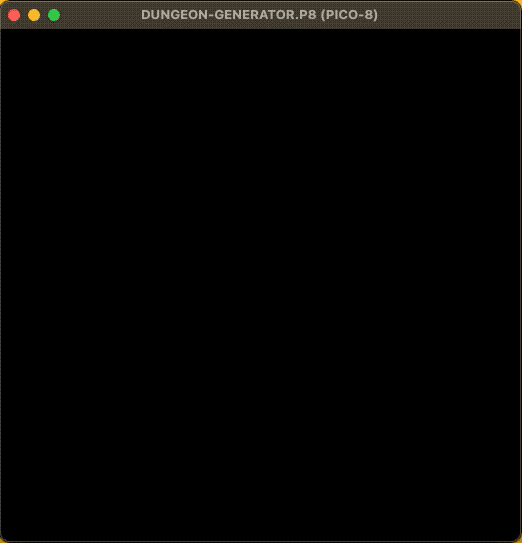
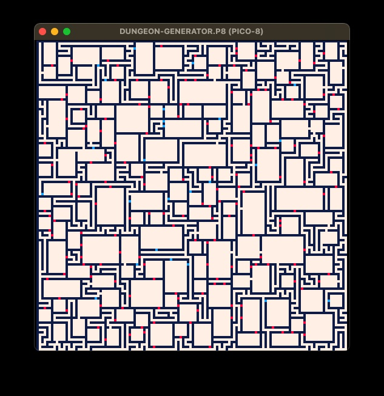
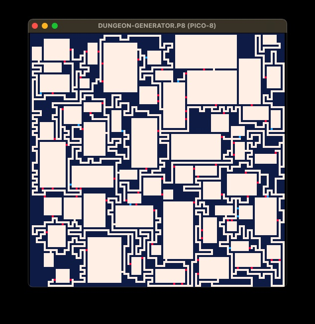
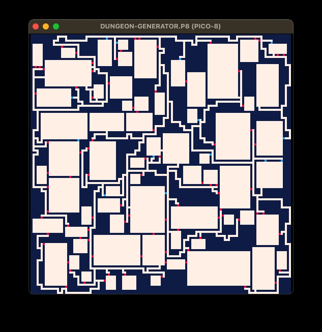

# Dungeon Generator

This repository contains a dungeon generator for Pico-8. The generator creates random dungeon layouts that can be used in various games.

## Features

- Randomly generates dungeon layouts
- Configurable parameters for dungeon size and complexity

## Configuration

You can configure the dungeon generator by modifying the parameters in the code. The main parameters you can adjust are:

- `method`: Determines the method used for dungeon generation. Options are:
  - `1`: Choose random
  - `2`: Choose oldest
  - `3`: Choose newest
- `dungeonWidth`: The width of the dungeon.
- `dungeonHeight`: The height of the dungeon.
- `tries`: The number of rooms to try. The greater the number, the more rooms.
- `xtrsz`: Additional size for rooms.
- `xtrconn`: The chance of adding extra cons between rooms.
- `exits`: The number of exits to create. Set to `0` for a perfect maze.

## Examples

Here are some examples of dungeons generated by the code:

## License

This project is licensed under the MIT License. See the [LICENSE](LICENSE) file for details.

## Acknowledgements

Additionally, the code can be optimized by removing the drawing part, the debug part, and some utilities that are not essential for the core functionality of the dungeon generator. 

Special thanks to the Pico-8 community for their support and inspiration. 

## References

- [Rooms and Mazes: A Procedural Dungeon Generator](https://journal.stuffwithstuff.com/2014/12/21/rooms-and-mazes/)
- [Maze Generation: Growing Tree Algorithm](https://weblog.jamisbuck.org/2011/1/27/maze-generation-growing-tree-algorithm)
